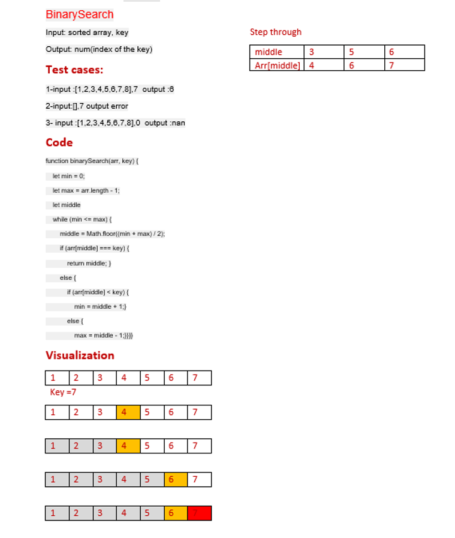

# Binary Search of Sorted Array
<!-- Description of the challenge -->
BinarySearch which takes in 2 parameters: a sorted array and the search key., return the index of the array’s element that is equal to the value of the search key, or -1 if the element is not in the array.

## Whiteboard Process
<!-- Embedded whiteboard image -->

## Approach & Efficiency
<!-- What approach did you take? Discuss Why. What is the Big O space/time for this approach? -->
O(logn) time efficincy

O(1) space  efficincy