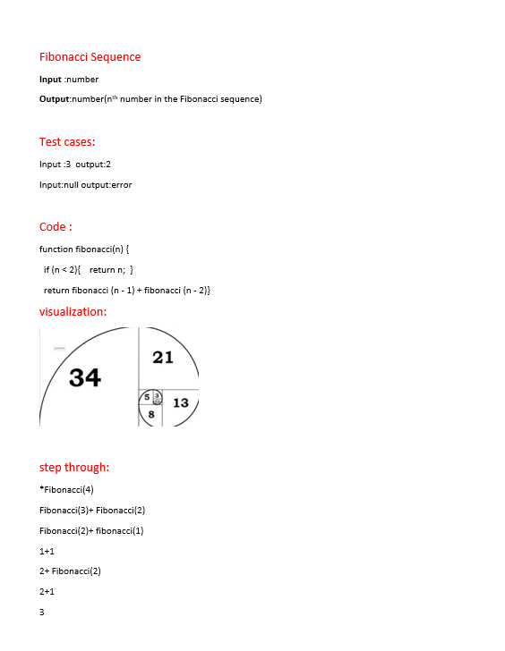

# fibonacci function
<!-- Description of the challenge -->
fibonacci function that accepts an integer, and returns the nth number in the Fibonacci sequence.

fibonacci(n)=fibonacci(n-1)+fibonacci(n-2);

## Whiteboard Process
<!-- Embedded whiteboard image -->

## Approach & Efficiency
<!-- What approach did you take? Discuss Why. What is the Big O space/time for this approach? -->
 O(2^N) time efficincy

O(1) space  efficincy
