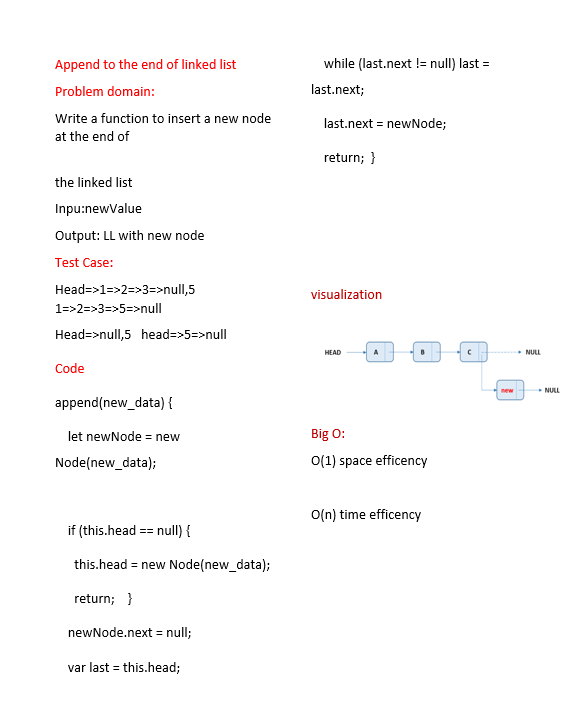

# Linked List insertion
<!-- Description of the challenge -->
we have three method:

1-append (value)===adds a new node with the given value to the end of the list

2-insertBefor(value,newValue)===adds a new node with the given new value immediately before the first node that has the value specified

3-insertAfter (value,newValue)===adds a new node with the given new value immediately after the first node that has the value specified

## Whiteboard Process
<!-- Embedded whiteboard image -->

## Approach & Efficiency
<!-- What approach did you take? Why? What is the Big O space/time for this approach? -->
**append(value)**

O(1) space efficency

O(n) time efficency

**inserBefor(value,newValue)**

O(1) space efficency

O(n) time efficency

**inserAfter(value,newValue)**

O(1) space efficency

O(n) time efficency
## Solution
<!-- Show how to run your code, and examples of it in action -->
to run this code write in terminal

 node index.js

example :

{1} -> {2} -> {10} -> {3} -> NULL
[nodemon] clean exit - waiting for changes before restart

[nodemon] restarting due to changes...

[nodemon] starting `node index.js`

{1} -> {2} -> {3} -> {10} -> NULL

[nodemon] clean exit - waiting for changes before restart

[nodemon] restarting due to changes...

[nodemon] starting `node index.js`

{1} -> {2} -> {3} -> {10} -> NULL