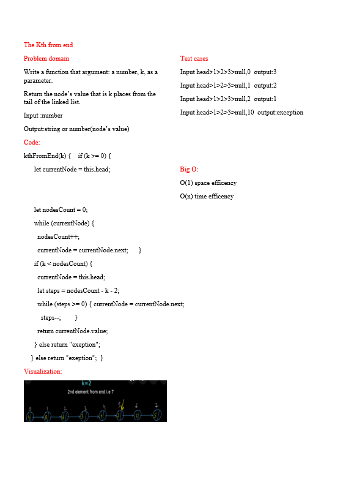

# Challenge Summary
<!-- Description of the challenge -->
kth from end

argument: a number, k, as a parameter.

Return the node’s value that is k places from the tail of the linked list.

## Whiteboard Process
<!-- Embedded whiteboard image -->

## Approach & Efficiency
<!-- What approach did you take? Why? What is the Big O space/time for this approach? -->

O(1) space efficency

O(n^2) time efficency

## Solution
<!-- Show how to run your code, and examples of it in action -->
to stsrt this code type in the terminal

node index.js

ex:

samah@DESKTOP-LDMN0NB:~/algo/data-structures-and-algorithms/javascript/code-challenges/javascript/class07$ node index.js
{1} -> {2} -> {3} -> {4} -> {5} -> NULL

4

samah@DESKTOP-LDMN0NB:~/algo/data-structures-and-algorithms/javascript/code-challenges/javascript/class07$ node index.js
{1} -> {2} -> {3} -> {4} -> {5} -> NULL

exeption
