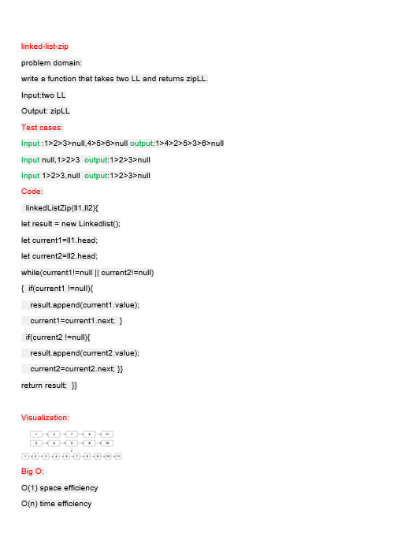

# linked-list-zip
<!-- Description of the challenge -->
function that Zip the two linked lists together into one so that the nodes alternate between the two lists and return a reference to the the zipped list.

## Whiteboard Process
<!-- Embedded whiteboard image -->

## Approach & Efficiency
<!-- What approach did you take? Why? What is the Big O space/time for this approach? -->
O(1) space efficiency

O(n) time efficiency

## Solution
<!-- Show how to run your code, and examples of it in action -->
to run this code write in terminal

 node index.js

 samah@DESKTOP-LDMN0NB:~/algo/data-structures-and-algorithms/javascript/code-challenges/javascript/class08$ node index.js

{1} -> {10} -> {2} -> {20} -> {3} -> {30} -> {4} -> {40} -> {50} -> NULL

samah@DESKTOP-LDMN0NB:~/algo/data-structures-and-algorithms/javascript/code-challenges/javascript/class08$ node index.js

{1} -> {10} -> {2} -> {20} -> {3} -> {30} -> {4} -> {40} -> {5} -> NULL