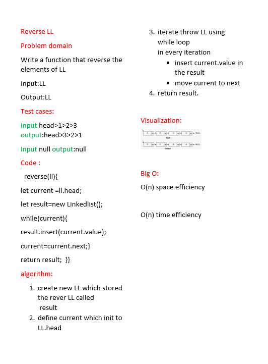

# Reverse LL
<!-- Description of the challenge -->
a function that reverse the elements of LL.

Input:LL

Output:reversed LL

## Whiteboard Process
<!-- Embedded whiteboard image -->

[PR]()

## Approach & Efficiency
<!-- What approach did you take? Why? What is the Big O space/time for this approach? -->
O(n) space efficiency

O(n) time efficiency

