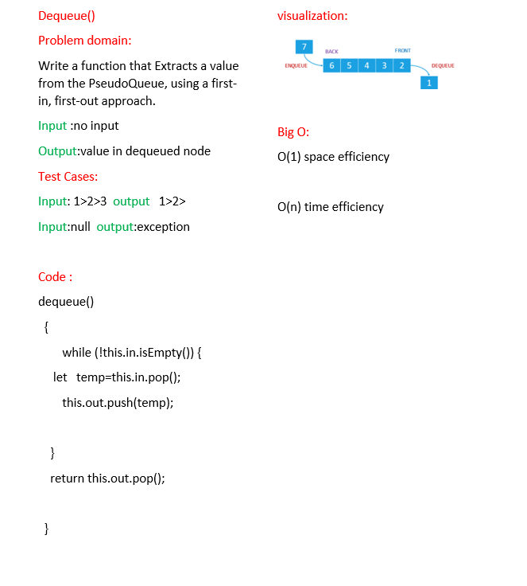

# PseudoQueue
<!-- Description of the challenge -->
building a queue using stacks.
utilize 2 Stack instances to create and manage the queue.

## Whiteboard Process
<!-- Embedded whiteboard image -->

[PR](https://github.com/alsatarysamah/data-structures-and-algorithms/pull/32/)

## Approach & Efficiency
<!-- What approach did you take? Why? What is the Big O space/time for this approach? -->
enqueue()

O(1) space efficiency

O(n) time efficiency

dequeue()

O(1) space efficiency

O(n) time efficiency

