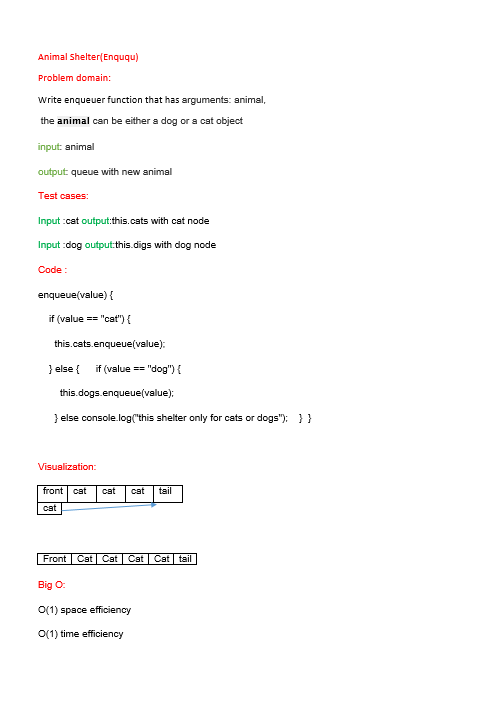
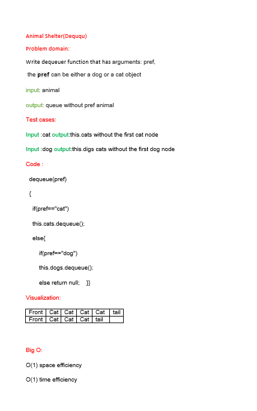

# Animal Shelter
<!-- Description of the challenge -->
AnimalShelter is a class which holds only dogs and cats.
The shelter operates using a first-in, first-out approach.

## Whiteboard Process
<!-- Embedded whiteboard image -->
[PR]()

## Approach & Efficiency
<!-- What approach did you take? Why? What is the Big O space/time for this approach? -->
**enqueue**

O(1) space efficiency

O(1) time efficiency

**dequeue**

O(1) space efficiency

O(1) time efficiency

## Solution
<!-- Show how to run your code, and examples of it in action -->
to run this code node index.js