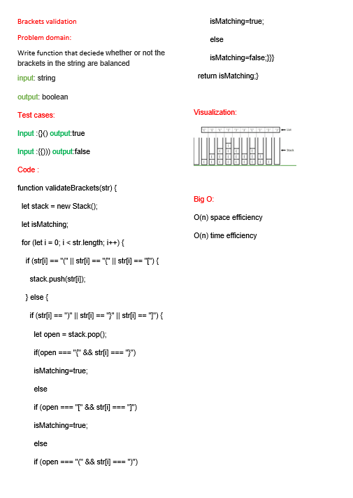

# Validate Brackets
<!-- Description of the challenge -->
function that deciede  whether or not the brackets in the string are balanced
## Whiteboard Process
<!-- Embedded whiteboard image -->
[PR]()

## Approach & Efficiency
<!-- What approach did you take? Why? What is the Big O space/time for this approach? -->

O(n) space efficiency

O(n) time efficiency

## Solution
<!-- Show how to run your code, and examples of it in action -->
to run this code type node index.js