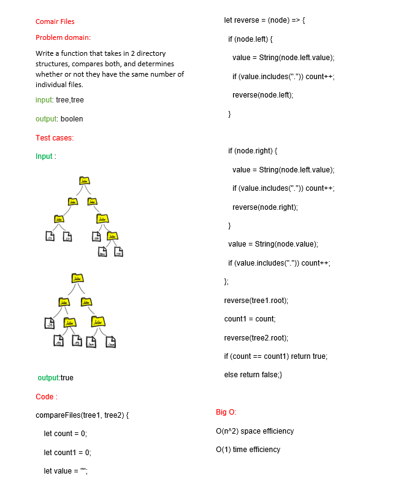

# Tree-breadth-first
<!-- Description of the challenge -->
function that that takes in 2 directory structures and compares both and determines whether or not they have the same number of individual files.
## Whiteboard Process
<!-- Embedded whiteboard image -->

## Approach & Efficiency
<!-- What approach did you take? Why? What is the Big O space/time for this approach? -->

O(1) space efficiency

O(n^2) time efficiency ,h: the hieght of the tree

## Solution
<!-- Show how to run your code, and examples of it in action -->
node index.js
