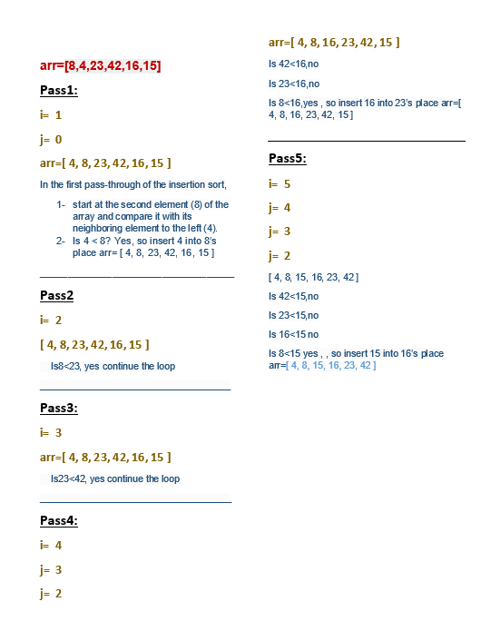

# Insertion sort 
<!-- Description of the challenge -->
Insertion sort is one of the  sorting algorithms

## Whiteboard Process
<!-- Embedded whiteboard image -->
[PR](https://github.com/alsatarysamah/data-structures-and-algorithms/pull/42/)

## Approach & Efficiency
<!-- What approach did you take? Why? What is the Big O space/time for this approach? -->

O(1) space efficiency

O(n^2) time efficiency

## Solution
<!-- Show how to run your code, and examples of it in action -->
node insertionSort.js
