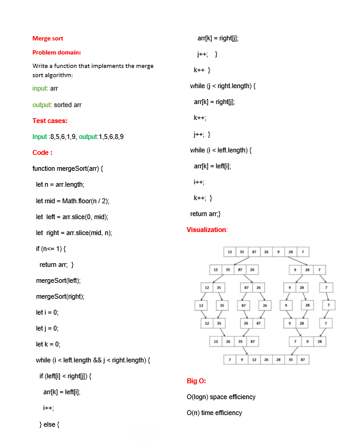

# Merge sort 
<!-- Description of the challenge -->
merge sort is one of the  sorting algorithms

# Whiteboard Process
<!-- Embedded whiteboard image -->
[PR]()

# Approach & Efficiency
<!-- What approach did you take? Why? What is the Big O space/time for this approach? -->

O(n) space efficiency

O(logn) time efficiency

## Solution
<!-- Show how to run your code, and examples of it in action -->
node mergSort.js