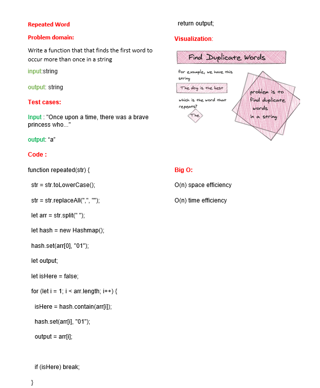

# Repeated function
<!-- Description of the challenge -->
A function that finds the first word to occur more than once in a string
Arguments: string
Return: string
## Whiteboard Process
<!-- Embedded whiteboard image -->
[PR](https://github.com/alsatarysamah/data-structures-and-algorithms/pull/49)

## Approach & Efficiency
<!-- What approach did you take? Why? What is the Big O space/time for this approach? -->
O(n) space efficiency

O(n) time efficiency
## Solution
<!-- Show how to run your code, and examples of it in action -->
node rpeated.js 
