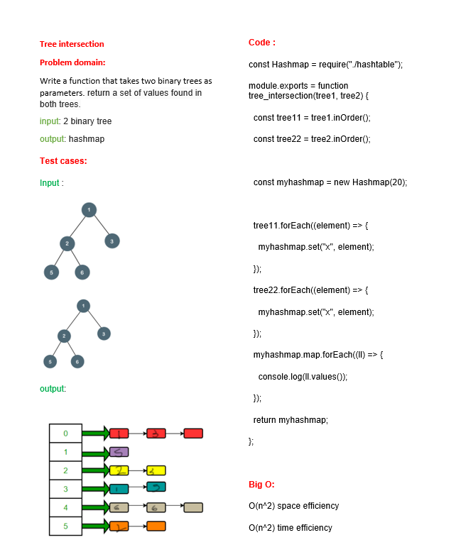

# Tree Intersection function
<!-- Description of the challenge -->
Write a function that takes two binary trees as parameters. return a set of values found in both trees.

input: 2 binary tree

output: hashmap

## Whiteboard Process
<!-- Embedded whiteboard image -->
[PR]()

## Approach & Efficiency
<!-- What approach did you take? Why? What is the Big O space/time for this approach? -->
O(n) space efficiency

O(n) time efficiency
## Solution
<!-- Show how to run your code, and examples of it in action -->
node index.js 